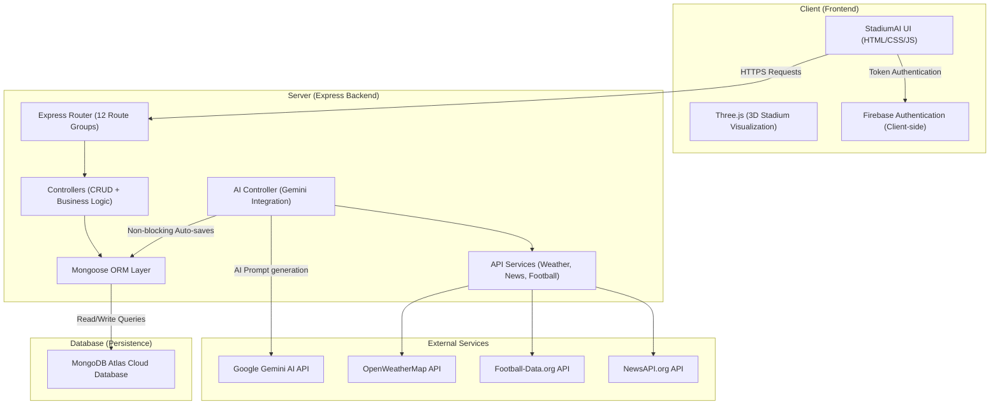

# 🏟️ StadiumAI — The Tournament Operating System

> **FIFA World Cup 2026 | Real-Time Stadium Intelligence Platform**

StadiumAI is a production-ready, AI-powered stadium operations platform built for the FIFA World Cup 2026. It provides real-time crowd management, AI-assisted incident response, multilingual announcements, smart transit coordination, and volunteer management — all in a single unified dashboard.

---

## 📊 System Design & Class Diagram

### 🧱 System Architecture



### 🗄️ Database Class & Schema Diagram (Mongoose)

```mermaid
classDiagram
    class User {
        +String uid (Firebase UID) [PK]
        +String email
        +String name
        +String role (fan, volunteer, organizer, security, medical-staff, admin, guest)
        +String photo
        +String phone
        +String language
        +String favoriteTeam
        +Boolean isActive
        +Date createdAt
        +Date updatedAt
    }

    class Incident {
        +ObjectId _id [PK]
        +String title
        +String description
        +String severity (LOW, MEDIUM, HIGH, CRITICAL)
        +String status (open, in-progress, resolved)
        +String category (security, medical, fire, crowd, facility, transit, weather, other)
        +String location
        +String stadium
        +String reportedBy
        +Boolean aiGenerated
        +Object aiPlaybook
        +Date createdAt
        +Date updatedAt
    }

    class Announcement {
        +ObjectId _id [PK]
        +String message
        +String language
        +Boolean generatedByAI
        +String createdBy
        +String priority (normal, high, critical)
        +String audience (all, volunteers, organizers, security, medical, spectators)
        +Object translations
        +String stadium
        +Boolean isActive
        +Date createdAt
        +Date updatedAt
    }

    class VolunteerTask {
        +ObjectId _id [PK]
        +String title
        +String description
        +String assignedTo (User UID)
        +String priority (low, medium, high, critical)
        +String status (pending, in-progress, completed, cancelled)
        +String location
        +String stadium
        +Date deadline
        +String aiAdvice
        +String eta
        +String distance
        +String riskLevel (low, medium, high)
        +Date createdAt
        +Date updatedAt
    }

    class Prediction {
        +ObjectId _id [PK]
        +String predictionType (crowd-density, egress-flow, incident-risk, weather-impact, other)
        +Object input
        +Object output
        +Number confidence
        +Boolean generatedByAI
        +String stadium
        +String requestedBy
        +Date createdAt
        +Date updatedAt
    }

    class Feedback {
        +ObjectId _id [PK]
        +String user (User UID or anonymous)
        +Number rating (1-5)
        +String comment
        +String category (general, navigation, ai-assistant, transit, accessibility, safety, app-performance)
        +String stadium
        +Date createdAt
        +Date updatedAt
    }

    class ChatHistory {
        +ObjectId _id [PK]
        +String userId (User UID or anonymous)
        +String role
        +String prompt
        +String response
        +String language
        +String stadium
        +Object weatherContext
        +String sessionId
        +String model
        +Date createdAt
        +Date updatedAt
    }

    class Stadium {
        +String stadiumId [PK]
        +String name
        +String city
        +String country
        +Number capacity
        +String address
        +Object coordinates
        +Array gates
        +Array parking
        +Array restaurants
        +Array foodCourts
        +Array medicalCenters
        +Array washrooms
        +Array fanZones
        +Object transport
        +Array nearbyHotels
        +Array nearbyHospitals
        +Array nearbyPolice
        +String openingHours
        +String closingHours
        +Array images
        +Boolean isActive
        +Date createdAt
        +Date updatedAt
    }

    class WeatherCache {
        +String stadium [PK]
        +Number temperature
        +Number feelsLike
        +Number humidity
        +Number wind
        +String windDirection
        +String condition
        +String conditionDesc
        +Number uvIndex
        +Number rainProbability
        +Number visibility
        +Number pressure
        +Number lat
        +Number lon
        +Date apiTimestamp
        +Date cachedAt [TTL Index]
    }

    class NewsCache {
        +ObjectId _id [PK]
        +String title
        +String source
        +String description
        +String url
        +String urlToImage
        +String category (football, world-cup, stadium, transport, weather, general)
        +String query
        +Date publishedAt
        +Date cachedAt [TTL Index]
    }

    User "1" --> "many" VolunteerTask : assigned tasks (uid)
    User "1" --> "many" Feedback : submits (uid/anonymous)
    User "1" --> "many" ChatHistory : chats (uid/anonymous)
    Stadium "1" --> "many" Incident : venues
    Stadium "1" --> "many" Announcement : locations
    Stadium "1" --> "many" VolunteerTask : tasks
    Stadium "1" --> "many" Prediction : telemetry
    Stadium "1" --> "1" WeatherCache : updates
```



---

## ✨ Features

| Feature | Description |
|---|---|
| 🤖 **AI Assistant** | Gemini-powered chatbot for fans, volunteers, security, and medical staff |
| 👁️ **Crowd Intelligence** | Real-time crowd density prediction and bottleneck alerts |
| 🚨 **Incident Command** | AI-generated incident playbooks with volunteer dispatch |
| 📢 **Multilingual PA** | Translate announcements to EN, ES, FR, HI, AR, JA instantly |
| 🚌 **Smart Transit** | Live metro, bus, rideshare, and parking coordination |
| ♿ **Accessibility Hub** | High-contrast mode, audio cues, wheelchair routing |
| 🌤️ **Live Weather** | Real-time weather via OpenWeatherMap integrated into AI context |
| 🗺️ **Geolocation** | User-to-stadium distance, nearest gate routing |
| 📰 **News Feed** | Live FIFA World Cup 2026 news feed |
| 👤 **Auth & Profiles** | Firebase Authentication with role-based access |
| 🗄️ **MongoDB Backend** | Full Atlas-connected REST API with 10 data models |

---

## 🏗️ Architecture

```
stadium/
├── StadiumAI.html          # Single-page frontend (all CSS + HTML)
├── assets/                 # Images, 3D model, stadium photos
├── data/                   # Static stadium JSON database
├── src/
│   └── main-v2.js          # Frontend JavaScript (tab control, API calls)
└── server/                 # Node.js + Express backend
    ├── config/
    │   └── database.js     # MongoDB Atlas connection (dual-strategy)
    ├── models/             # 10 Mongoose schemas
    │   ├── User.js
    │   ├── Incident.js
    │   ├── Announcement.js
    │   ├── VolunteerTask.js
    │   ├── Prediction.js
    │   ├── Feedback.js
    │   ├── ChatHistory.js
    │   ├── Stadium.js
    │   ├── WeatherCache.js
    │   └── NewsCache.js
    ├── controllers/        # Business logic (one per model + dashboard + AI)
    ├── routes/             # Express routers (12 route files)
    ├── middleware/         # errorHandler, asyncWrapper, requestLogger
    ├── utils/              # responseFormatter, helpers, logger
    ├── services/           # geminiService, weatherService, footballService, newsService
    ├── .env.example        # Environment variables template
    └── index.js            # Server entry point
```

---

## 🚀 Quick Start

### Prerequisites
- Node.js v18+
- MongoDB Atlas account
- Google Gemini API key

### 1. Clone the repository
```bash
git clone https://github.com/hetutrivedi2005-cmyk/Stadium-AI.git
cd Stadium-AI
```

### 2. Set up environment variables
```bash
cd server
cp .env.example .env
# Edit .env with your own API keys
```

### 3. Install dependencies
```bash
npm install
```

### 4. Whitelist your IP in MongoDB Atlas
1. Go to [cloud.mongodb.com](https://cloud.mongodb.com)
2. **Network Access** → **+ ADD IP ADDRESS** → **ADD CURRENT IP ADDRESS**
3. Confirm and wait ~30 seconds

### 5. Start the backend server
```bash
node index.js
```

### 6. Open the frontend
Serve `StadiumAI.html` via any static server:
```bash
# From the root stadium directory:
npx serve . -p 8099
# Then open: http://localhost:8099/StadiumAI.html
```

---

## 📡 API Reference

| Method | Endpoint | Description |
|---|---|---|
| GET | `/health` | Server + MongoDB status |
| GET | `/api/dashboard/summary` | All stats in one call |
| POST | `/api/ai/chat` | Gemini chat (auto-saves to ChatHistory) |
| POST | `/api/ai/incident` | AI incident playbook (auto-saves to Incident) |
| POST | `/api/ai/predict` | Crowd prediction (auto-saves to Prediction) |
| POST | `/api/ai/translate` | PA announcement translation (auto-saves to Announcement) |
| GET/POST | `/api/users` | User management |
| GET/POST/PUT/DELETE | `/api/incidents` | Incident CRUD + stats |
| GET/POST/PUT/DELETE | `/api/announcements` | Announcement CRUD |
| GET/POST/PUT/DELETE | `/api/volunteer-tasks` | Volunteer task CRUD |
| GET/POST | `/api/predictions` | Prediction history |
| GET/POST | `/api/feedback` | Feedback + average rating |
| GET/POST | `/api/chat-history` | Chat session history |
| GET/POST/PUT/DELETE | `/api/stadiums` | Stadium database CRUD |
| GET/POST | `/api/weather-cache` | Weather cache (TTL: 30 min) |
| GET/POST | `/api/news-cache` | News cache (TTL: 1 hour) |

---

## 🛠️ Tech Stack

**Frontend**
- HTML5 + Vanilla CSS + JavaScript
- Three.js (3D stadium visualization)
- Firebase Authentication

**Backend**
- Node.js + Express.js
- MongoDB Atlas + Mongoose
- Google Gemini AI (`@google/genai`)
- OpenWeatherMap API
- Football-data API
- NewsAPI

---

## 🌍 Supported Languages

English · Español · Français · हिन्दी · العربية · 日本語

---

## 📸 Supported Stadiums

- 🇲🇽 Estadio Azteca — Mexico City
- 🇺🇸 SoFi Stadium — Los Angeles
- 🇺🇸 MetLife Stadium — New York

---

## ⚠️ Security Note

**Never commit your `.env` file.** Use `.env.example` as a template. The `.gitignore` excludes all `.env` files automatically.

---

## 🏆 Built For

**FIFA World Cup 2026 Hackathon** — Competing against 40+ AI projects.

> *"This must look like a funded startup's flagship product."*

---

*StadiumAI — Where Intelligence Meets the Beautiful Game.*
