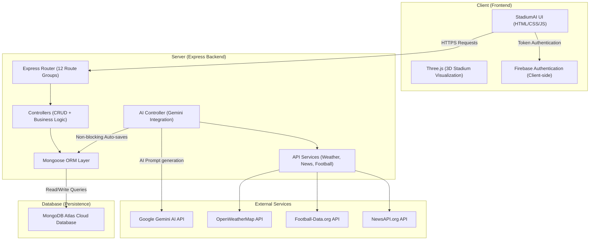

# 🏟️ StadiumAI — The Tournament Operating System

> **FIFA World Cup 2026 | Real-Time Stadium Intelligence Platform**

StadiumAI is a production-ready, AI-powered stadium operations platform built for the FIFA World Cup 2026. It provides real-time crowd management, AI-assisted incident response, multilingual announcements, smart transit coordination, and volunteer management — all in a single unified dashboard.

---

## 📊 System Design & Class Diagram

### 🧱 System Architecture



### 🗄️ Database Class & Schema Diagram (Mongoose)


---

## ✨ Features

| Feature | Description |
|---|---|
| 🤖 **AI Assistant** | Gemini-powered chatbot for fans, volunteers, security, and medical staff |
| 👁️ **Crowd Intelligence** | Real-time crowd density prediction and bottleneck alerts |
| 🚨 **Incident Command** | AI-generated incident playbooks with volunteer dispatch |
| 📢 **Multilingual PA** | Translate announcements to EN, ES, FR, HI, AR, JA instantly |
| 🚌 **Smart Transit** | Live metro, bus, rideshare, and parking coordination |
| ♿ **Accessibility Hub** | High-contrast mode, audio cues, wheelchair routing |
| 🌤️ **Live Weather** | Real-time weather via OpenWeatherMap integrated into AI context |
| 🗺️ **Geolocation** | User-to-stadium distance, nearest gate routing |
| 📰 **News Feed** | Live FIFA World Cup 2026 news feed |
| 👤 **Auth & Profiles** | Firebase Authentication with role-based access |
| 🗄️ **MongoDB Backend** | Full Atlas-connected REST API with 10 data models |

---

## 🏗️ Reorganized Architecture

```
stadium-ai/
├── client/                 # Frontend Static Directory (Vercel)
│   ├── index.html          # Main web application entry point
│   ├── assets/             # 3D assets and static images
│   ├── data/               # Static venue JSON database
│   ├── src/                # Front-end UI and service logic modules
│   ├── package.json        # Client dependencies & scripts
│   └── vercel.json         # Vercel static router configurations
├── server/                 # Express REST API Backend (Render)
│   ├── config/             # DB configurations
│   ├── controllers/        # Route controllers
│   ├── data/               # AI backend local data copies
│   ├── middleware/         # App middleware
│   ├── models/             # Mongoose schemas
│   ├── routes/             # REST route files
│   ├── services/           # Backend API clients
│   ├── utils/              # Shared helper functions
│   ├── index.js            # Main backend entry point
│   ├── .env.example        # Environment variable sample
│   └── package.json        # Server configurations
├── package.json            # Workspace dev scripts (root)
└── README.md               # Main instructions
```

---

## 🚀 Local Development

### 1. Install Workspace Dependencies
Run from the root directory to install client and server packages simultaneously:
```bash
npm run install-all
```

### 2. Configure Environment Variables
Create a `.env` file inside the `server/` directory (use `server/.env.example` as a template):
```bash
cp server/.env.example server/.env
# Edit server/.env with your operational credentials
```

### 3. Start Development Servers
From the root directory:
*   To run the backend server: `npm run dev`
*   To run the frontend client: `npm run client`

---

## ☁️ Production Deployment

### 🖥️ Frontend (Vercel)
1.  Connect your GitHub repository to **Vercel**.
2.  Set the **Root Directory** to `client`.
3.  Add the optional environment variable `VITE_API_URL` pointing to your deployed Render URL (e.g. `https://your-backend.onrender.com/api`). If omitted, it will dynamically fall back to relative `/api` calls.
4.  Click **Deploy**. Vercel will host the client statically.

### 📡 Backend (Render)
1.  Create a new **Web Service** on **Render**.
2.  Select your repository and set the **Root Directory** to `server`.
3.  Set the **Start Command** to `npm start`.
4.  Configure all required environment variables (`MONGODB_URI`, `GEMINI_API_KEY`, etc.) in the Render dashboard settings.
5.  Click **Deploy**. Render will run the isolated Express REST backend.

---

## 📡 API Reference

| Method | Endpoint | Description |
|---|---|---|
| GET | `/health` | Server + MongoDB status |
| GET | `/api/dashboard/summary` | All stats in one call |
| POST | `/api/ai/chat` | Gemini chat (auto-saves to ChatHistory) |
| POST | `/api/ai/incident` | AI incident playbook (auto-saves to Incident) |
| POST | `/api/ai/predict` | Crowd prediction (auto-saves to Prediction) |
| POST | `/api/ai/translate` | PA announcement translation (auto-saves to Announcement) |
| GET/POST | `/api/users` | User management |
| GET/POST/PUT/DELETE | `/api/incidents` | Incident CRUD + stats |
| GET/POST/PUT/DELETE | `/api/announcements` | Announcement CRUD |
| GET/POST/PUT/DELETE | `/api/volunteer-tasks` | Volunteer task CRUD |
| GET/POST | `/api/predictions` | Prediction history |
| GET/POST | `/api/feedback` | Feedback + average rating |
| GET/POST | `/api/chat-history` | Chat session history |
| GET/POST/PUT/DELETE | `/api/stadiums` | Stadium database CRUD |
| GET/POST | `/api/weather-cache` | Weather cache (TTL: 30 min) |
| GET/POST | `/api/news-cache` | News cache (TTL: 1 hour) |

---

## 🛠️ Tech Stack

**Frontend**
- HTML5 + Vanilla CSS + JavaScript
- Three.js (3D stadium visualization)
- Firebase Authentication

**Backend**
- Node.js + Express.js
- MongoDB Atlas + Mongoose
- Google Gemini AI (`@google/genai`)
- OpenWeatherMap API
- Football-data API
- NewsAPI

---

## 🌍 Supported Languages

English · Español · Français · हिन्दी · العربية · 日本語

---

## 📸 Supported Stadiums

- 🇲🇽 Estadio Azteca — Mexico City
- 🇺🇸 SoFi Stadium — Los Angeles
- 🇺🇸 MetLife Stadium — New York

---

## ⚠️ Security Note

**Never commit your `.env` file.** Use `.env.example` as a template. The `.gitignore` excludes all `.env` files automatically.

---

## 🏆 Built For

**FIFA World Cup 2026 Hackathon** — Competing against 40+ AI projects.

> *"This must look like a funded startup's flagship product."*

---

*StadiumAI — Where Intelligence Meets the Beautiful Game.*
